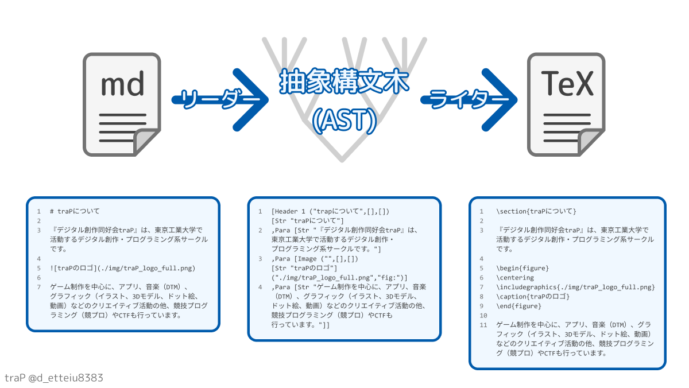
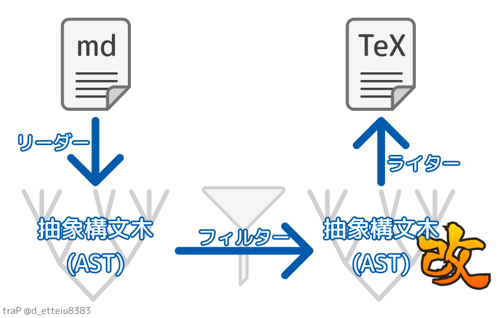
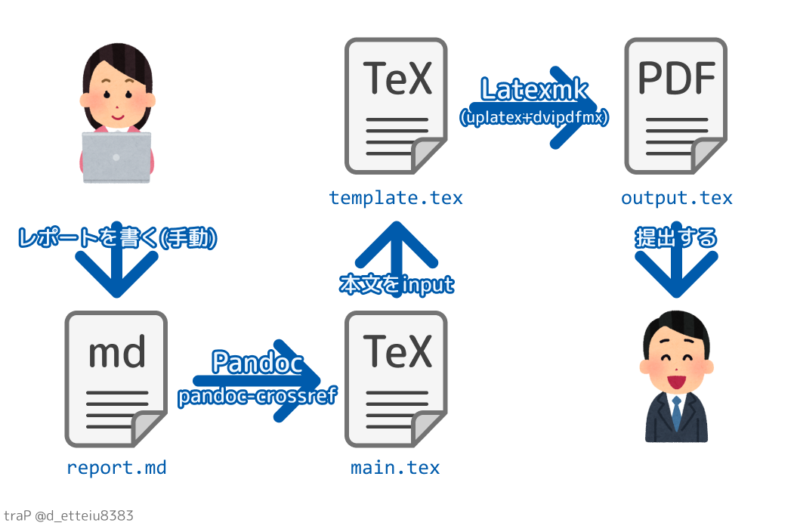

こんにちは、\@d_etteiu8383です。この記事はtraP夏のブログリレー9月29日の記事です。
この記事では私のレポート制作環境(PandocとLatexmkを使ったPDF作成の自動化)の紹介をします。
既に似た内容の記事が多く存在するため新規性の無い記事ではありますが、皆さんの参考になったら幸いです。

\tableofcontents \newpage

# 目的

以下この記事を書こうと思った経緯↓

1. コロナウィルスの影響により、私が所属している系の必修科目である実験科目が延期される
2. 夏季期間講義として(夏休みを削って)本来のスケジュールを圧縮して週四回の実験科目が開講されることになる
3. 週四回以上のレポート提出を要求される
4. くるしい

普段はWordか\LaTeX を用いてレポートを書いていたのですが、Word文書の見た目を整えるのが苦手だったり、そもそもWord自体動作が重かったり、\LaTeX はコマンド書くのが大変だったりして、レポート1つ仕上げるのに非常に時間がかかっていました。そこでレポートの制作環境を見直し、ここにまとめることにしました。手書き、\LaTeX 直書き、Wordで作る...いろいろ手段はあると思いますが、「そういう方法もあるんだなぁ」程度に読んでもらえると嬉しいです。ここでは最低限講義レポートととして提出できるレベルのPDFファイルを(なるべく楽して)出力することを目的とします。

:::warning
レポートに追われながら書いているので(特に後半)かなり雑な記事になってしまっています。わかりづらい点などありましたらコメントで教えてもらえるとありがたいです。レポート倒したら必ず更新しに来ます。
:::

## 環境 {-}

- Windows10
- Pandoc 2.10.1
- pandoc-crossref-Windows-2.10.1
- TeXLive 2020

# 原理

以下の手順でレポートを作成していきます。(ほとんど<https://blog.8tak4.com/post/168232661994/know-how-writing-thesis-markdown>で紹介されている手順を参考にしているのでこちらを見ていただいたほうがわかりやすいかもしれません...)

1. Markdownでレポート本文を書く
2. BibTeXで文献情報をまとめる
3. Pandocで1のMarkdownファイルをtexファイルに変換する
4. 3のtexファイルからLatexmkを使ってPDFを作成する
5. (表紙PDFが指定されている場合)Pythonで表紙PDFと結合

以下で各手順の概要を説明します。環境構築や実際に作成するファイルの内容は[@sec:houhou]で紹介します。

## Markdownでレポート本文を書く {#sec:write-report}

まず初めに、読み書きが非常に楽なMarkdown記法を用いてレポート本文を作成します。Markdownのコマンドは \LaTeX に比べて非常に簡単なので、コマンドミス等に気を取られずレポート本文に集中して執筆ができます。実はこのブログ記事もMarkdown記法を用いて執筆しています。めっちゃ楽。Markdownを使う事のメリットとしては、git diff等で差分の確認が簡単にできることも挙げられます。MSWordのdocx形式はバイナリ形式なのでテキストに変換しないとdiffが見れないです。

具体的なコマンドやMarkdownの活用法についてまとまっているこちらの記事もぜひご覧ください→[情報系以外の方にもおすすめしたいMarkdown](https://trap.jp/post/371/)

本記事とは関係ない話ですが、弊サークルの部内SNS traQ[^1] ではメッセージ中でMarkdown記法を利用できます。すごい。

[^1]:traQについて詳しく知りたい方はこちらの記事をご覧ください→[爆☆誕 traQ-S【新歓ブログリレー2020 54日目】](https://trap.jp/post/1051/)

## BibTeXで文献情報をまとめる

BibTeXとは、\LaTeX における参考文献の整形ツールです。`.bib`の拡張子を持つ参考文献の情報を記述したファイルを作成することで、著者名等を自動で整形し、相互参照(\hyperlink{cross-ref}{後述})したうえで適切に出力してくれます。

## PandocでMarkdownファイルをtexファイルに変換する {#sec:md2tex}

Markdownは本来プレーンテキスト形式で書かれた文章からHTMLを生成するために開発されたものでした。しかし、現在ではHTML以外の形式のファイルへ変換するソフトも多数存在します。今回はその1つである**Pandoc**というコンバータを用いて[@sec:write-report]で作成したMarkdownファイルからtexファイルへの変換を行います。

### Pandocの仕組み

そもそもPandocはMarkdownや\LaTeX に限らず、HTMLやWordなど多種多様なフォーマット間の変換が可能なツールです。対応フォーマットの一覧や、より詳しい使い方については[公式ページ](https://pandoc.org/)や、
[Pandocユーザーズガイド 日本語版](https://pandoc-doc-ja.readthedocs.io/ja/latest/users-guide.html)をご覧ください。

Pandocは以下のような手順で文書を変換しています。(<https://github.com/jgm/pandoc/blob/master/README.md> より引用)

>Pandoc has a modular design: it consists of a set of readers, which parse text in a given format and produce a native representation of the document (an abstract syntax tree or AST), and a set of writers, which convert this native representation into a target format. Thus, adding an input or output format requires only adding a reader or writer.

まずPandocは入力された変換前の文書を、**リーダー**というプログラムを用いて**抽象構文木**(abstract syntax tree, AST)と呼ばれる形式に変換します。抽象構文木についておおざっぱに説明すると「もとの文章の意味を保持したまま、その各要素を種類によって区別し(見出しなのか？本文なのか？表なのか？図なのか？など)、いい感じに整理整頓したもの」といった感じ。次に**ライター**というプログラムを用い、この抽象構文木を指定の出力形式に変換します。つまりPandocは入力文書を直接出力形式に変換しているのではなく、一度汎用的な形式に変換してから再度目的形式に変換する、という二度の変換を行っています。リーダーとライターを分けているので、新しい形式を利用したい場合は必要なリーダー/ライターを追加するだけで対応できるようになっています。クレバー。

{#fig:pandoc_description}

### Pandoc-crossrefによる相互参照 {#sec:cross-ref}

「Pandocは一度入力ファイルをAST形式に変換している」と説明しましたが、このAST形式のドキュメントに手を加えることで変換処理をカスタマイズできる**フィルター**という仕組みが存在します。(以下 <https://github.com/jgm/pandoc/blob/master/README.md> より引用)

>Users can also run custom pandoc filters to modify the intermediate AST (see the documentation for filters and Lua filters).

具体的には[@fig:pandoc_filter_description]に示すように、AST形式の文書を入力として受け取り、AST形式の文書を出力するプログラムを途中に挟むことで変換処理のカスタマイズを実現しています。こうすることで、入力形式に依存しないカスタマイズと、カスタマイズの容易化を実現しています。スマート。

{#fig:pandoc_filter_description}

フィルターに関する詳細は <https://pandoc.org/filters.html> をご覧ください。

今回はPandocのフィルターの1つである**pandoc-crossref**というフィルターを用いて文書内での相互参照ができるようにします。\hypertarget{cross-ref}{相互参照}とは、「[@fig:pandoc_description]にPandocの変換動作例を示す。」の「[@fig:pandoc_description]」のように、図や表、数式、コードブロックの参照番号を自動でつけてくれる機能です。手入力で「図Xに~~を示す。」などと記述してしまうと、編集過程で図やページ順番が変わってしまった場合にいちいち直さなくてはなりません。\LaTeX では`\label{}`と`ref{}`を用いることで相互参照が可能ですが、通常のMarkdown形式に相互参照機能は無いためpandoc-crossrefを用いた相互参照を行います。

## texファイルからLatexmkを使ってPDFを作成する {#sec:tex2pdf}

次に[@sec:md2tex]で作成したtexファイルからLatexmkを利用してPDFを生成します。そもそもtexファイルからPDFを作成するには、基本的に以下の手順を踏むことになります。

1. texファイルからdviファイルを作成する
2. dviファイルからPDFファイルを作成する

手順1で生成するdviファイルには文書のレイアウトに関する情報が記録されており、これをもとに手順2で組版を行います。手順1を行うためにpLaTeXやupLaTeXというエンジンを、手順2を行うためにdvipdfmxなどのソフトを用います。texファイルから直接PDFファイルを生成するpdfLaTeX、XeLaTeX、LuaLaTeX等も存在します。どの処理系を使うかは好みの問題になりますが、私は手順1にupLaTeXを、手順2にdvipdfmxを使用しています[^2]。

と、ここでは最大2回の操作でPDFが完成するかのように書いていますが、実際はこの操作を何度か繰り返さないと相互参照が正しく表示されません。これらの操作をいちいち手動で繰り返すのは面倒なので、**Latexmk**で自動化します。Latexmkは、上に述べたPDF作成までに必要な操作を必要回数自動で行ってくれるツールです。Latexmkについてはこちらのサイトでより詳しく紹介されています→[Latexmkから学ぶPDF化までの処理の流れ](https://qiita.com/Rumisbern/items/d9de41823aa46d5f05a8)

[^2]:実はPandoc単体でもMarkdown形式の文書から内部で勝手に\LaTeX を経由してPDFを生成することもできるのですが、これでは少し融通が利かない部分があったりしたので私は一度texファイルを生成してからPDFを作っています。

## Pythonで表紙PDFと結合

表紙PDFが指定されている場合は表紙PDFの結合も行います。ウェブアプリの利用などでも出来ますが、Pythonのライブラリ**PyPDF2**を使ってサクッと出来たのでこれも自動化しています。参考:[Python, PyPDF2でPDFを結合・分割（ファイル全体・個別ページ）](https://note.nkmk.me/python-pypdf2-pdf-merge-insert-split/)、<https://github.com/mstamy2/PyPDF2>

# 方法 {#sec:houhou}

以下に具体的な環境構築・レポート作成手順を示します。(<https://github.com/detteiu8383/Markdown2PDF>から引っ張ってきていい感じにカスタマイズしてもらえると嬉しい)

## 各種インストール

### Markdown

Markdownファイルの作成に特別な準備はほとんど必要ありません。一般的なテキストエディタにはMarkdownのプレビュー機能やショートカットがあることが多いです。私はVSCodeかTyporaで書いています。TyporaはMarkdown専用のエディタで、リアルタイムのプレビュー機能が便利なのでよく使っています。Typoraの特徴やインストールは[公式サイト](https://typora.io/)を参照してください。

### Pandocのインストール

Pandocのインストールは[Pandocの比較的簡単なインストール方法](https://qiita.com/sky_y/items/3c5c46ebd319490907e8)で詳しく説明されているので紹介させていただきます。基本的には<https://github.com/jgm/pandoc/blob/master/INSTALL.md>に示されている手順に従えば大丈夫です。

### pandoc-crossrefのインストール

こちらも基本的には<https://github.com/lierdakil/pandoc-crossref#installation>に示されている手順に従えばOKです。[リリースページ](https://github.com/lierdakil/pandoc-crossref/releases/latest)からダウンロードし、パスが通っている所に配置します。

### TeXLive(uplatex,dvipdfmx,biber,Latexmk)のインストール

LaTeXの環境構築はTeXLiveで行うのが多分楽だと思います。詳しくはTeX Wikiの<https://texwiki.texjp.org/?TeX%20Live>で説明されているのでこちらを参照してください。

## 実際の手順

### ディレクトリ構造

実際に作成するファイルは以下のようにしています。

```
./
│  .latexmkrc   <- Latexmkの設定ファイル
│  build.bat    <- コマンドの自動化
│
├─dest
│      output.pdf <- 生成されるPDF
│
└─src
    │  cover.pdf         <- 表紙PDF
    │  references.bib    <- 文献情報
    │  report.md         <- レポート本文のMarkdown
    │
    ├─img
    │      pandoc_description.png <- レポートに挿入する画像
    │      ...
    │
    └─templates
            config.yml    <- Pandocの設定ファイル
            merger.py     <- 表紙PDFが指定されている場合、これでPDFの結合をする
            template.tex  <- テンプレートのtexファイル
```

### Markdownでレポート本文を書く

残念ながらこの手順は手動です。頑張ってください。今回例として作成したMarkdownファイルは<https://github.com/detteiu8383/Markdown2PDF/blob/master/src/report.md>にあります。これを`report.md`として保存。

### BibTeXで文献情報をまとめる

文献データを作成します。フォーマットについては<https://ja.wikipedia.org/wiki/BibTeX>で詳しく紹介されています。以下具体例。

```
@book{
  Laala,
  author="プリパラ制作委員会",
  title="プリパラ＆アイドルタイムプリパラ設定資料集＜上＞ ＜プリズムボイス編＋ドリームパレード編＞",
  publisher="小学館",
  year="2019",
  pages="96--97"
}
```

このように、著者名やタイトルをまとめた`references.bib`を作り、本文内で

```
真中らぁらのキャラクターデザインがほぼ決定したのは2013年7月のことであり、制作初期段階では"ことり"と名づけられていた\cite{Laala}。
```

と書くと、以下のようにコンパイルされます。

\vspace{0.2in}

真中らぁらのキャラクターデザインがほぼ決定したのは2013年7月のことであり、制作初期段階では"ことり"と名づけられていた\cite{Laala}。

\vspace{0.2in}

最後に書いた`\cite{Laala}`が"\cite{Laala}"に書き変わっていますね。さらに参考文献欄に自動的に整形された書誌情報が記載されます。`\cite{}`は \LaTeX のコマンドですが、Markdown内で \LaTeX のコマンドを使用した場合もちゃんと\LaTeX のコマンドとして処理してくれます。

## メタデータの記述

Pandocでの変換に関する設定ファイルを作成します。図表を相互参照したとき、デフォルトでは "fig.1" のように参照されてしまうので、これを日本語化するために次のようなファイル`config.yml`を作成し、コマンド実行時に指定します。

```
figureTitle: "図"
tableTitle: "表"
listingTitle: "コード"
figPrefix: "図"
eqnPrefix: "式"
tblPrefix: "表"
lstPrefix: "コード"
secPrefix: "セクション"
```

## PandocでMarkdownファイルをtexファイルに変換する

次に上で記述した`report.md`を`main.tex`に変換します。基本的には以下のコマンドを実行することになります。

```
pandoc --filter pandoc-crossref \
  --top-level-division=section \
  -M "crossrefYaml=.\src\templates\config.yml" \
  .\src\report.md -o .\src\main.tex
```

1行目:Pandocを使用、フィルターとしてpandoc-crossrefを用いる。
2行目:トップレベルの見出しを`section`(節)にする。このほか`default`,`chapter`,`part`が使用可能
3行目:メタデータの設定
4行目:`report.md`を`main.tex`に変換

これによって生成される`main.tex`はドキュメント部分のみ(\LaTeX の`\begin{document}`の中身部分)なので、プリアンブルを記述した`template.tex`内でこれをinputします。

私が使用している`template.tex`は<https://github.com/detteiu8383/Markdown2PDF/blob/master/src/templates/template.tex>にあるのでご覧ください。

## texファイルからLatexmkを使ってPDFを作成する

Latexmkの詳しい使い方は[@sec:tex2pdf]で紹介させていただいたサイトで説明されているのでそちらをご覧ください。私は以下のような`.mklatexrc`を作っています。

```
#!/usr/bin/env perl
$latex = 'uplatex -halt-on-error';
$latex_silent = 'uplatex -halt-on-error -interaction=batchmode';
$biber = 'biber --bblencoding=utf8 -u -U --output_safechars';
$dvipdf = 'dvipdfmx %O -o %D %S';
$makeindex = 'mendex %O -o %D %S';
$max_repeat = 10;
$pdf_mode = 3;
```

各オプションは<https://qiita.com/Rumisbern/items/d9de41823aa46d5f05a8#latexmk>で詳しく説明されています。このような設定ファイルを作成することで、面倒なコンパイルが

```
latexmk template.tex
```

とコマンドを実行するだけで終わります。

## Pythonで表紙PDFと結合

PyPDF2を`pip install PyPDF2`でインストールし、次に示す`merger.py`を作成します。

```
import sys
import PyPDF2

args = sys.argv

merger = PyPDF2.PdfFileMerger()

for path in args[1:-1]:
    merger.append(path)

merger.write(args[-1])
merger.close()
```

これで

```
python merger.py cover.pdf page1.pdf page2.pdf page3.pdf output.pdf
```

のように実行すれば、1ページ目から順に`cover.pdf`、`page1.pdf`、`page2.pdf`、`page3.pdf`が結合された`output.pdf`が生成されます。

## バッチファイルにまとめる

以上の操作を次に示すバッチファイルにまとめ、コマンド実行も自動化します。

```
@echo off
setlocal EnableDelayedExpansion

set PROJECT_DIR=%cd%
mkdir tmp
xcopy /e src tmp
copy .latexmkrc tmp
cd tmp
pandoc --filter pandoc-crossref ^
--top-level-division=section ^
-M "crossrefYaml=templates\config.yml" ^
report.md -o main.tex
move templates\template.tex .\
latexmk template
python .\templates\merger.py cover.pdf template.pdf output.pdf
move output.pdf %PROJECT_DIR%/dest/output.pdf
cd %PROJECT_DIR%
rd /S /Q tmp
endlocal
pause
```

やっていることとしては、

1. 作業用に`tmp`フォルダを作成し、`src`フォルダ内のファイルを全部コピー
2. `tmp`フォルダ内でコンパイル
3. 表紙PDFが指定されている場合、`merger.py`でPDFの結合を行う 必要なかったら`rem`でコメントアウトするか消す
4. 生成された`output.pdf`だけ出力用フォルダの`dest`に移動して、`tmp`フォルダは削除

といった感じです。これで`dest`にできたてほかほかの`output.pdf`が産まれます。

{width=100%}

# 結果

以上の手順を用いて実際にMarkdownからPDFに変換したファイルが、今ご覧になっている**この**PDFです。変換元のMarkdownは<https://github.com/detteiu8383/Markdown2PDF/blob/master/src/report.md>でご確認ください。

Markdownと\LaTeX のコマンドの対応は<https://github.com/detteiu8383/Markdown2PDF/blob/master/README.md#markdown%E5%BD%A2%E5%BC%8F%E3%81%A8latex-%E3%82%B3%E3%83%9E%E3%83%B3%E3%83%89%E3%81%AE%E5%AF%BE%E5%BF%9C>に示しているのでご覧ください。

# 考察

- コードブロックのシンタックスハイライトと背景色変更が上手く働いてくれていない
  - \LaTeX 力が足りな過ぎてShaded環境とかHighlighting環境がちゃんと動いてない...?レポート終わったら直します。
  - (生命系の学生なのでレポートにコード貼る機会がそもそも無くてちゃんと整備していない)
- 参考文献がはみ出ている
  - レポート終わったら直します...

# 感想

真のレポート製造機は私だったというオチ。レポート執筆部分がボトルネックになっているので誰かここも自動化してください。

この記事執筆時も未提出レポートが数件溜まっていて本当は記事とか書いている場合じゃないのですがせっかくのブログリレーなので書かせていただきました。未提出レポートが片付いたらもっと丁寧に書き直します。最後まで読んでくださりありがとうございます。

明日の担当はtemmaさんです。たのしみ～